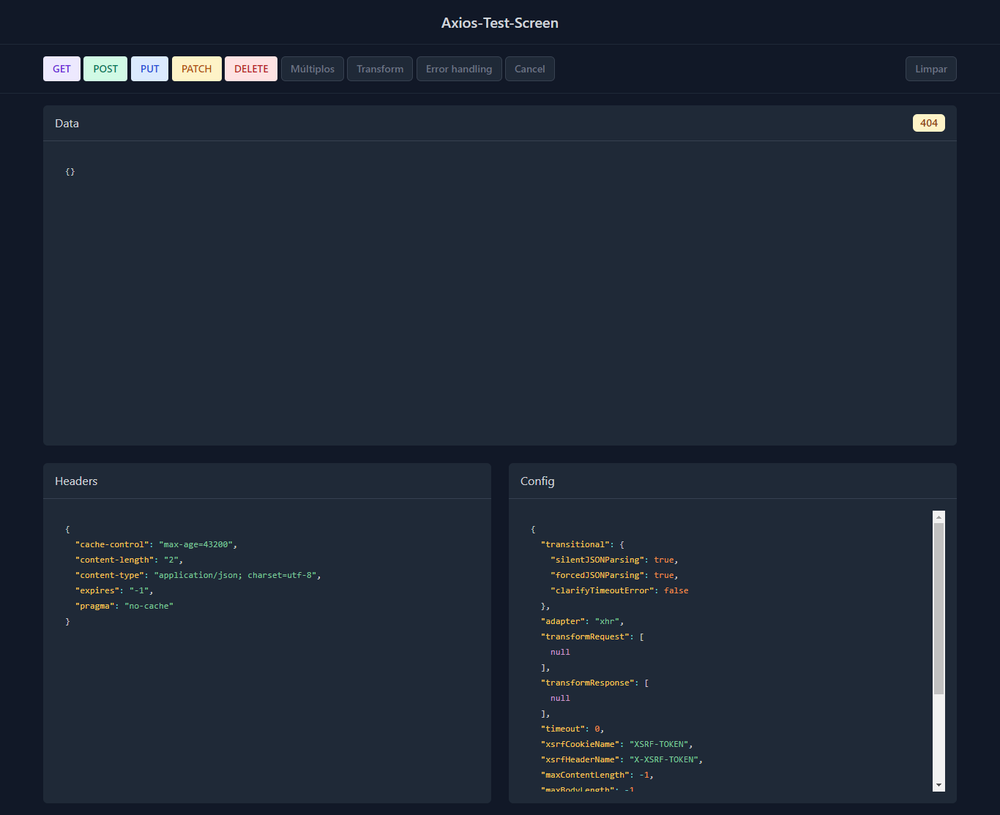

# Axios-Test-Screen

# tela simples para testar solicitações de axios.

Uma forma de fazer conexões http com back-end.

# Como Funciona:

Acesse o link: https://thesko27.github.io/Axios-Test-Screen/

Clique no botão, e espere o resultado da chamada;

# Tecnologias:

HTML5
CSS3
JavaScript
Axios
